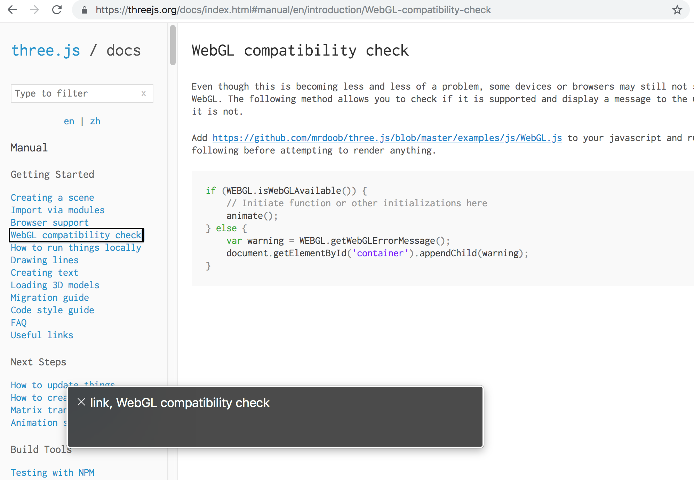
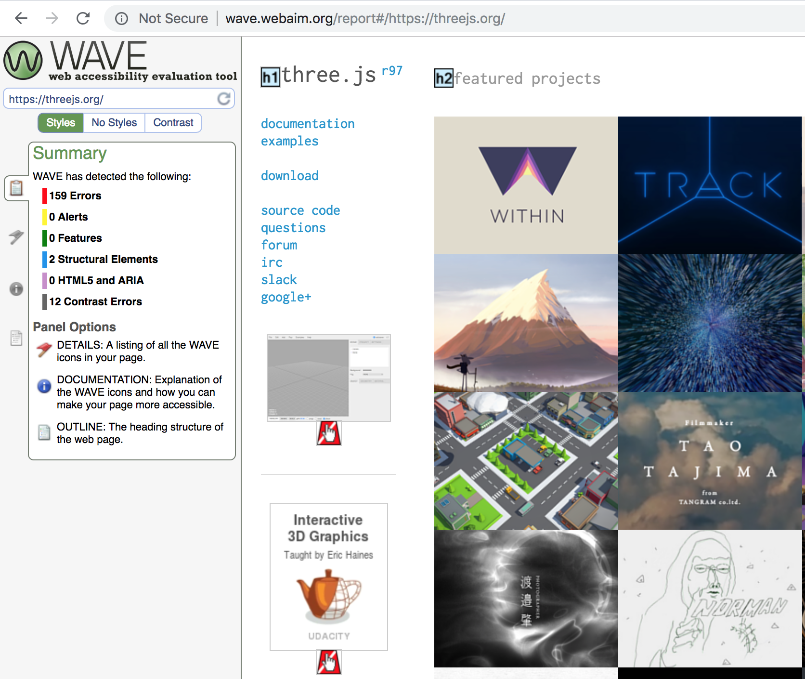
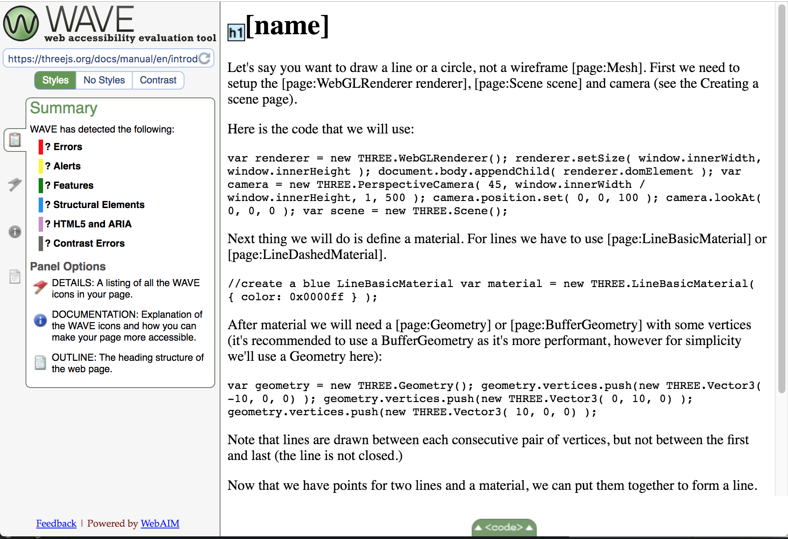
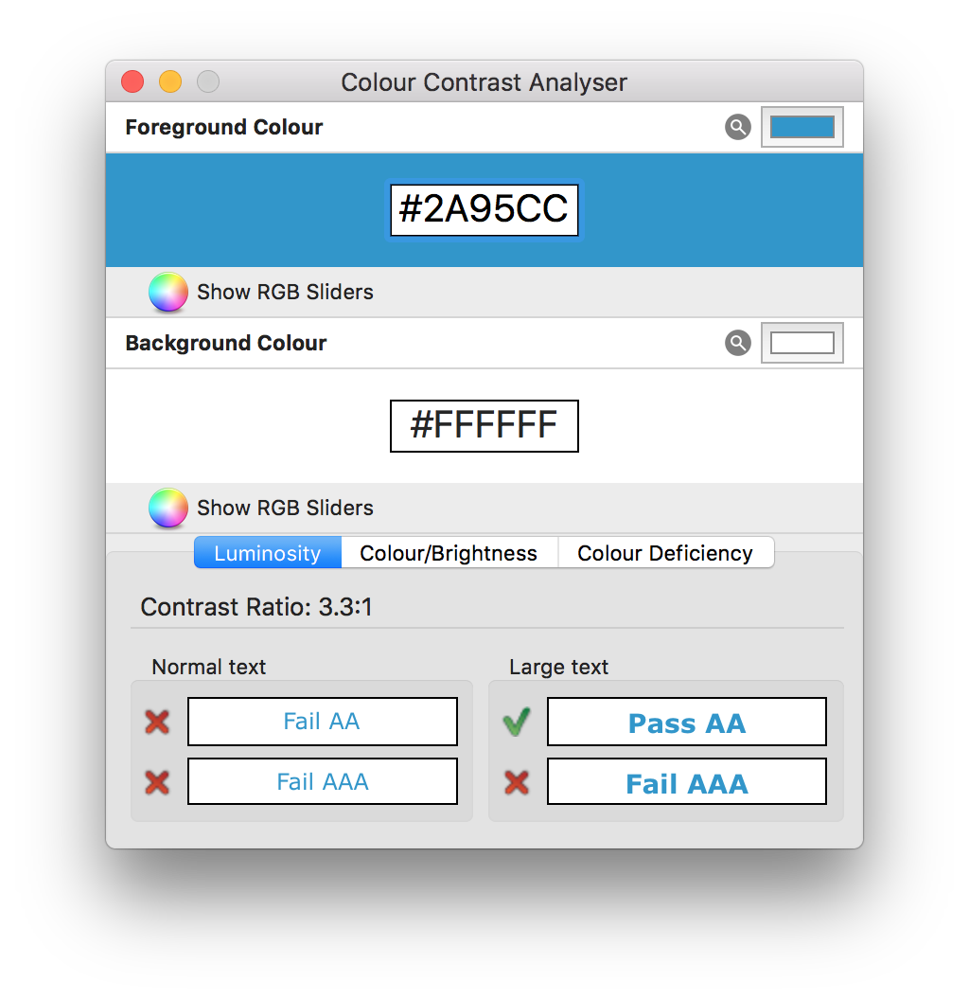
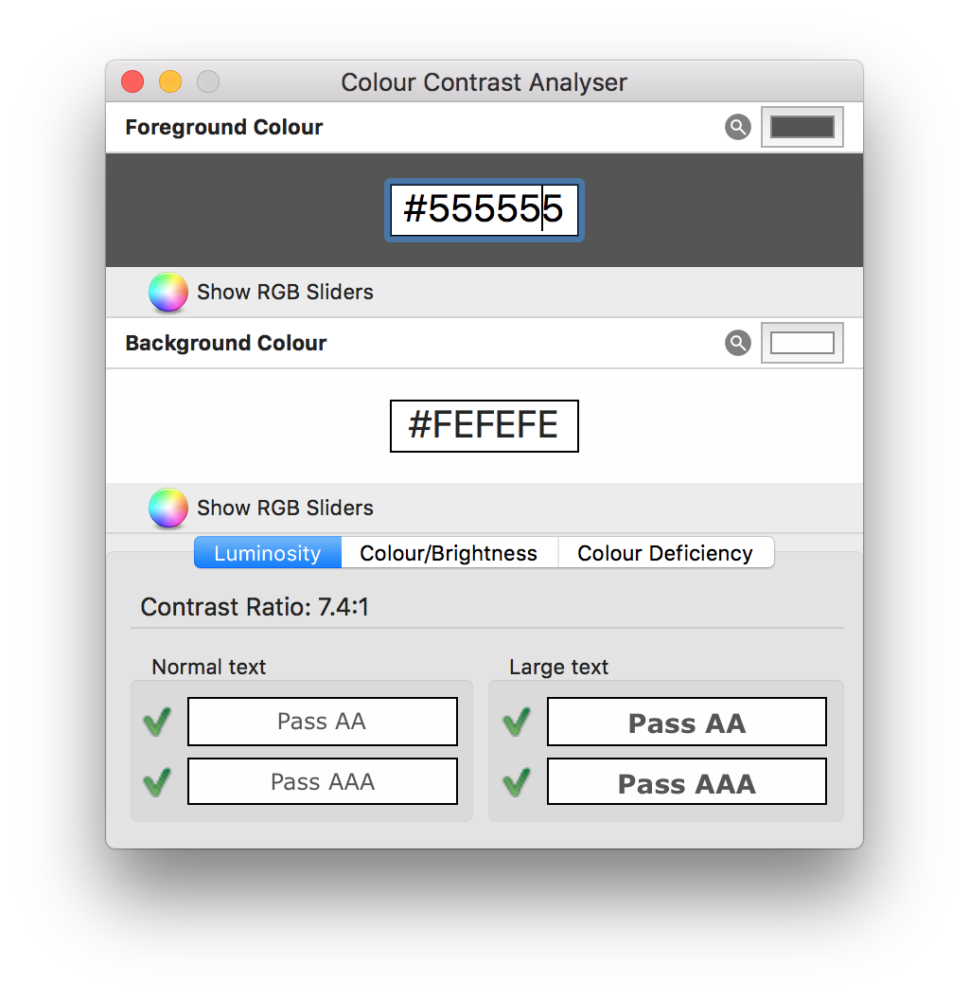

# Accessibility for 3d web graphics

For this assignment I chose to evaluate three.js' website in terms of accessibility for blind people.

## Screen reading
It was very hard to navigate this website with the screen reader. The structure of `iframe` is not very friendly with this technology. I found myself very frustrated when trying to move from the sidebar to the main content and back. While I know I'm inexperienced with the screen reader, on the previous experiments I was much more successful in navigating the sites, so it's not something that can be solely attributed to that.

## WAVE analysis
Using the [web version of WAVE (Web Accessibility Evaluation Tool)](http://wave.webaim.org/) I could point to many more hurdles to accessibility on the site. The images rarely have an alt text and some links don't have descriptions. Moreover, the site doesn't use semantic tags, having multiple `div` all over the place.

Another problem that branched from the use of `iframe`s is that it doesn't render correctly. It does not take any CSS, and the main title of each site is missing (maybe it's something that comes from the main sidebar?). I don't know if this is strictly an accessibility issue or maybe derived from the WAVE tool, but surely a site should not break like that.

## Colour and Contrast checking
Checking for the proper colour contrast is very straight forward using the Colour Contrast Analyzer App. We can see that the titles used on the website barely pass the test (only passes AA for large text), but the dark gray works great with the light background, passing every test.

