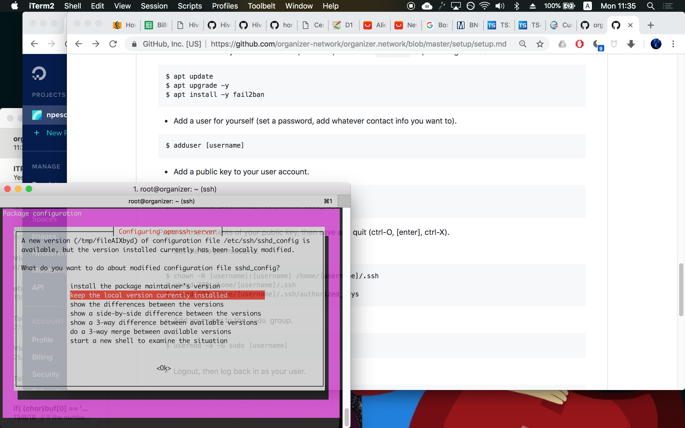
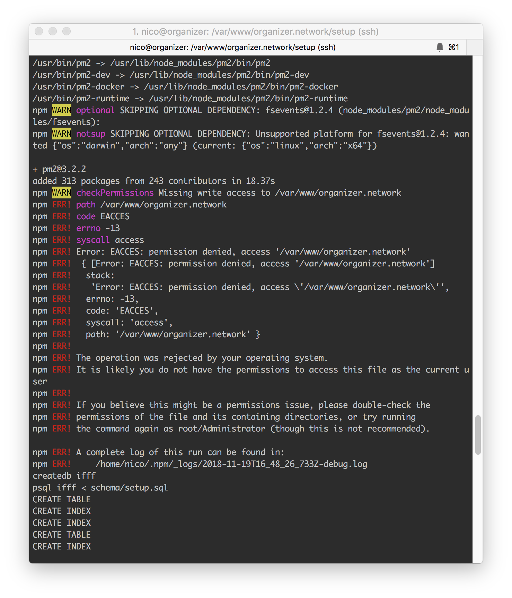
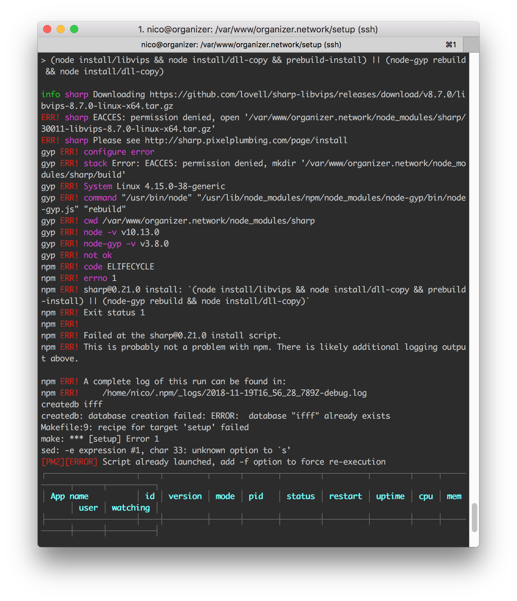
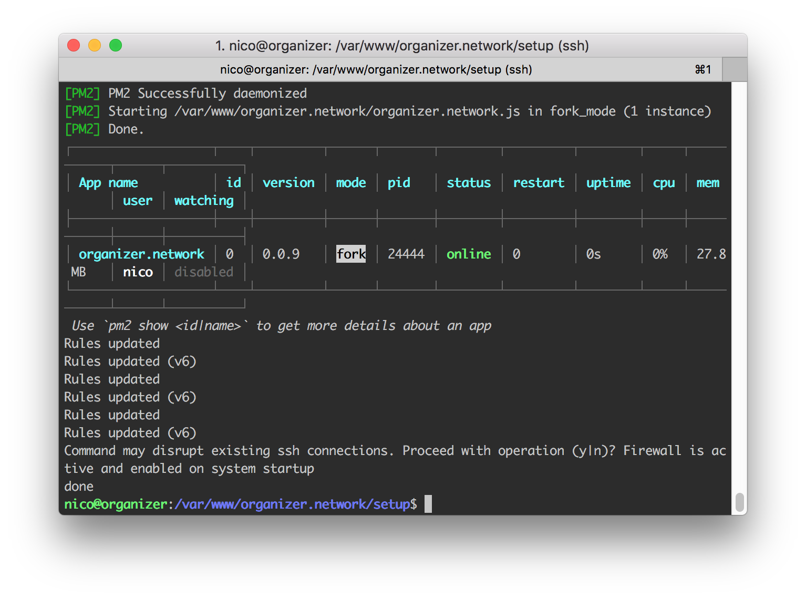

# Installation notes, first try

I tried setting up an instance of organizer.network, and ran into some issues along the way. In the end, the setup did not work, so I hope this helps clear questions, help update the tutorial and solve future issues.

- I didn’t know how to create the public key used [GitHub’s tutorial](https://help.github.com/articles/generating-a-new-ssh-key-and-adding-it-to-the-ssh-agent))
- I got some weird messages when updating the server machine

- One point of confusion is when cloning the repository. We are told to create the folder `/var/www/organizer.network` but when going in and cloning the repo, it is created in `organizer.network/organizer.network`, so the instruction should be changed to (after cloning) go to `./organizer.network/setup/`
  - I got confused by these locations, so I tried not creating the first folder and cloning directly into `/var/www/`. This did not go well, I got multiple errors when running the setup script. Seemed liked they were access errors, so I used `sudo ./ubuntu_setup.sh` but still failed (had to use `sudo` later anyway)
  
  
  - Also, the script has an automatic response about firewall connections and I thought I had timeout and got kinda anxious (as I wasn't paying attention) (figured out it was automated after doing it again)
  

- For the last step, I don't know where the `config.js` file is or if we're supposed to create it. At the same time, there are example `config.js` files in two different folders, which makes the step even less clear.

Other than these issues, it was a great guide! Easy to follow, though it has some minor mistakes (typos, etc)
